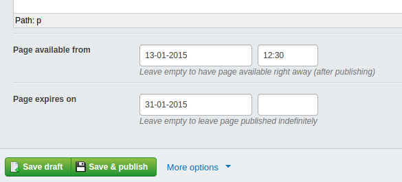

# SoftScheduler

*Maintained by [Restruct](https://github.com/restruct). If this module saves you time, you can
[support ongoing maintenance](https://github.com/sponsors/restruct).*

## Non-cron embargo & expiry for Silverstripe pages

This module lets editors set when a page should become available (embargo) and when it should
expire. It's called 'softscheduler' because it doesn't take care of publishing or unpublishing pages.
Instead it checks whether a published page should be available according to its embargo/expiry
dates, at the moment it is requested. No cron job or queue is needed.

- Someone with the `VIEW_DRAFT_CONTENT` permission (administrators included) can always open the page.
- Leaving both dates empty means the page is always visible.
- With only an expiry date, the page is visible until it expires.
- With only an embargo date, the page becomes visible once the embargo passes, and does not expire.

## Screenshots

*Schedule pages to become available/expire on certain dates & times*


## Requirements

* Silverstripe 5 or 6 (`silverstripe/cms`)
* PHP 8.1 or newer

## Installation

```
composer require restruct/silverstripe-softscheduler
```

Apply the extension to the page types that need scheduling (eg. news items), then flush and build the
database (`sake dev/build flush=1` on Silverstripe 5, `sake db:build --flush` on Silverstripe 6):

```yaml
---
name: 'schedulerextension'
---
Restruct\SilverStripe\NewsGrid\NewsGridPage:
  extensions:
    - Restruct\SilverStripe\SoftScheduler\EmbargoExpiryExtension
```

[restruct/silverstripe-newsgrid](https://github.com/restruct/silverstripe-newsgrid) does this for its
news items automatically when both modules are installed.

## What it does

The extension adds two datetime fields, `Embargo` and `Expiry`, to the page types it is applied to,
and shows them in a collapsible "Schedule publishing & unpublishing of this page" group placed before
the Content field (the group is named `SoftScheduler`).

A published page is **scheduled** while its embargo date is in the future, and **expired** once its
expiry date has passed. For visitors without `VIEW_DRAFT_CONTENT`, a scheduled or expired page:

- **answers 404 when opened by its URL**, with the site's normal "page not found" response (the 404
  error page, when one exists) - not a login form;
- **reports `canView()` false on the front end**, so it drops out of menus and other lists that
  check `canView()`;
- **is left out of queries on the extended page type** (for example `NewsGridPage::get()`) on the
  Live stage. On the draft stage it is left out for everyone without `VIEW_DRAFT_CONTENT`.

The Live-stage filter applies to users with `VIEW_DRAFT_CONTENT` as well, so front-end listings look
the same for editors as for visitors. When the extension is applied to a page subclass they can still
open a scheduled page by its URL; when it is applied to `SiteTree` itself, see Limitations. Inside the CMS
nothing is filtered, and the site tree marks pages with a "Scheduled" or "Expired" status flag.

The extension only ever *denies* viewing. Outside those cases it leaves `canView()` to the page's own
"Who can view this page" settings.

Dates are compared against Silverstripe's clock (`DBDatetime::now()`), in PHP's time zone, which is
the time zone the dates are stored in.

### Limitations

- **The query filter covers queries on the extended class only.** A query on a parent class, such as
  `SiteTree::get()` or `Page::get()` when the extension is applied to a subclass, is not filtered;
  those pages are still hidden from `canView()`-checked lists and answer 404 by URL.
- **Applied to `SiteTree` itself, editors need the draft stage to open a scheduled page.** The URL
  lookup is then a query on the extended class, so on the Live stage it is filtered for everyone,
  users with `VIEW_DRAFT_CONTENT` included, and they get a 404. Add `?stage=Stage` to the URL (or use
  the CMS preview) to see the page before its embargo passes or after it expires.
- **Caching.** Nothing changes in the database when an embargo or expiry moment passes, so a static
  or partial cache keyed only on edit dates keeps serving the old state. Include the scheduling state
  (for example `$publishedStatus`) or the dates in the cache key, or keep cache lifetimes short. Static
  publishing is not supported.

## Public API

Methods added to the page, for templates and code:

| Method | Returns |
|---|---|
| `publishedStatus()` | `true` unless the page is scheduled or expired; convenient in a partial-cache key (`$publishedStatus`) |
| `getScheduledStatus()` | `true` when the page is published and its embargo is in the future |
| `getExpiredStatus()` | `true` when the page is published and its expiry has passed |
| `getEmbargoIsSet()` / `getExpiryIsSet()` | `true` when the page is published and the date is set |
| `ScheduledStatusDataColumn()` | HTML describing both dates with an icon, for a GridField column (newsgrid uses it for its "Scheduling" column) |

There are no configuration options.

## Version compatibility

| Branch | Module version | Silverstripe | PHP |
|--------|----------------|--------------|-----|
| `main` | `3.x` | `^5 \|\| ^6` | `^8.1` |
| (tags only) | `2.0` | `^4.3` | as Silverstripe 4 |

`composer.json` is the source of truth. Silverstripe 4 reached end of life in April 2025 and is no
longer supported or tested here; projects still on it should stay on the `2.0` tag, which remains
available. `main` is the only maintained line: it supports every Silverstripe version this module
still targets. Upgrading from 2.0? See [UPGRADING.md](UPGRADING.md).

## Running the tests

The suite needs a booted Silverstripe project. Install the module into one as a **symlinked** path
repository (`/tests` is export-ignored, so a dist install contains no tests), then run it with a flush:

```
# Silverstripe 5 (PHPUnit 9): the flush argument must follow an explicit path
vendor/bin/phpunit vendor/restruct/silverstripe-softscheduler/tests flush=1

# Silverstripe 6 (PHPUnit 11)
SS_PHPUNIT_FLUSH=1 vendor/bin/phpunit vendor/restruct/silverstripe-softscheduler/tests
```

`.github/workflows/ci.yml` builds such a project for each supported Silverstripe major.
